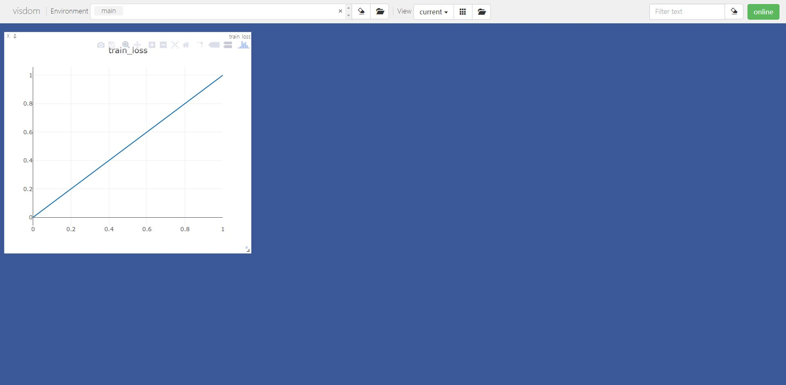
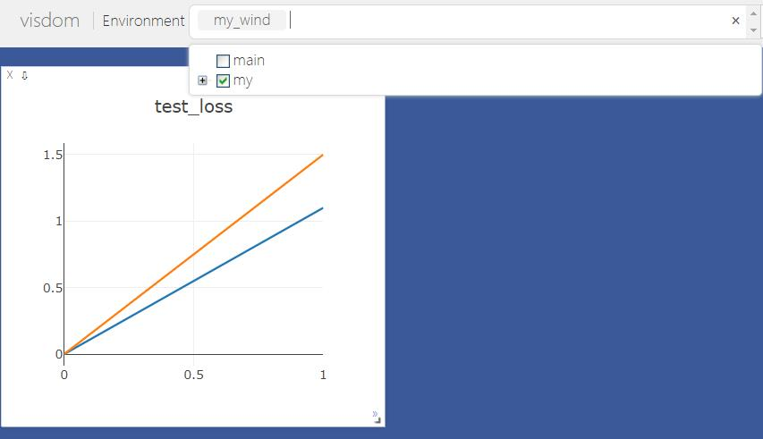
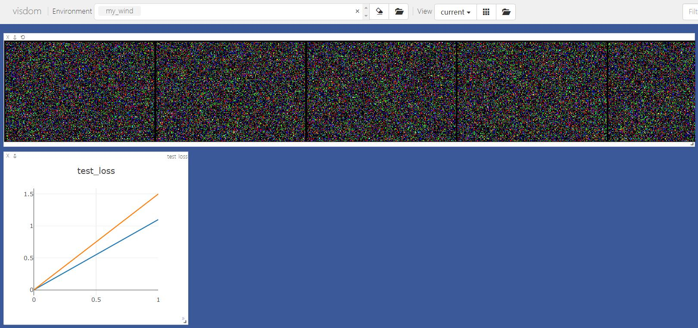
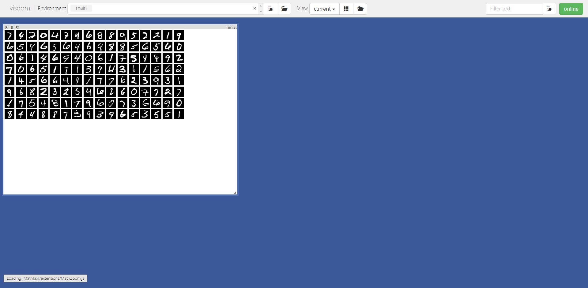
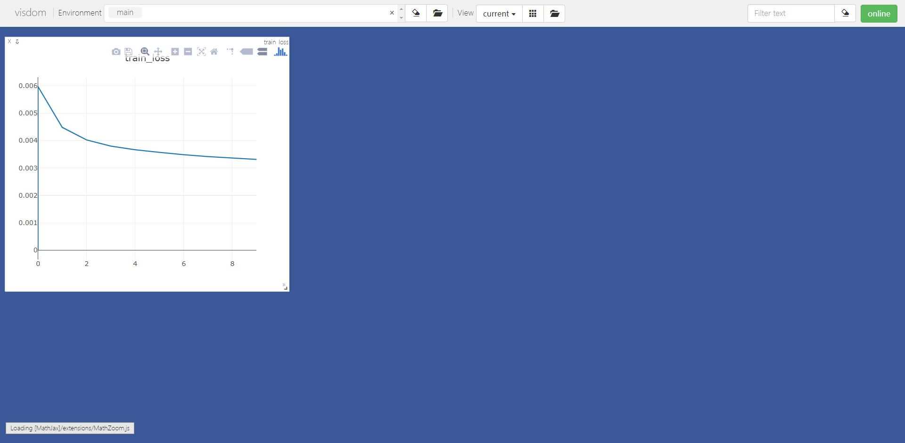

## **Visdom的介绍**

Visdom是Facebook专为PyTorch开发的实时可视化工具包，其作用相当于TensorFlow中的Tensorboard，灵活高效且界面美观，下面就一起来学习下如何使用吧！如果想更多了解关于Visdom的使用可以参考官方https://github.com/facebookresearch/visdom

首先来欣赏下官方提供的Visdom的可视化界面


## Visdom的安装

- 安装非常简易，只需要打开cmd窗口，输入一下命令即可快速安装完成


```python
pip install visdom
```

## Visdom的使用

类似于TensorFlow的TensorBoard，要使用Visdom，就要先在终端开启监听命令，根据显示的网址然后在浏览器里输入：http://localhost:8097 进行登录，此时如果报错，别怕，参考以下网站一定能轻松解决（新版visdom已经解决了可以使用pip install --upgrade visdom进行更新即可）：

https://blog.csdn.net/zl1107604962/article/details/104229548?utm_medium=distribute.pc_relevant.none-task-blog-BlogCommendFromMachineLearnPai2-2.nonecase&depth_1-utm_source=distribute.pc_relevant.none-task-blog-BlogCommendFromMachineLearnPai2-2.nonecase

**开启监听命令**

    python -m visdom.server # 或者直接visdom

## Visdom可视化函数及其参数一览

- 具体使用方法仍然可以参考上述网站，限于篇幅，这里主要列举最常用的line函数以及image函数的使用方法

**visdom基本可视化函数**

    - vis.image : 图片
    - vis.line: 曲线
    - vis.images : 图片列表
    - vis.text : 抽象HTML 输出文字
    - vis.properties : 属性网格
    - vis.audio : 音频
    - vis.video : 视频
    - vis.svg : SVG对象
    - vis.matplot : matplotlib图
    - vis.save : 序列化状态服务端

**上述函数参数**

- 注意opt的参数都可以用python字典的格式传入，大家可以参考下方使用方法

        - opts.title : 图标题
        - opts.width : 图宽
        - opts.height : 图高
        - opts.showlegend : 显示图例 (true or false)
        - opts.xtype : x轴的类型 ('linear' or 'log')
        - opts.xlabel : x轴的标签
        - opts.xtick : 显示x轴上的刻度 (boolean)
        - opts.xtickmin : 指定x轴上的第一个刻度 (number)
        - opts.xtickmax : 指定x轴上的最后一个刻度 (number)
        - opts.xtickvals : x轴上刻度的位置(table of numbers)
        - opts.xticklabels : 在x轴上标记标签 (table of strings)
        - opts.xtickstep : x轴上刻度之间的距离 (number)
        - opts.xtickfont :x轴标签的字体 (dict of font information)
        - opts.ytype : type of y-axis ('linear' or 'log')
        - opts.ylabel : label of y-axis
        - opts.ytick : show ticks on y-axis (boolean)
        - opts.ytickmin : first tick on y-axis (number)
        - opts.ytickmax : last tick on y-axis (number)
        - opts.ytickvals : locations of ticks on y-axis (table of numbers)
        - opts.yticklabels : ticks labels on y-axis (table of strings)
        - opts.ytickstep : distances between ticks on y-axis (number)
        - opts.ytickfont : font for y-axis labels (dict of font information)
        - opts.marginleft : 左边框 (in pixels)
        - opts.marginright :右边框 (in pixels)
        - opts.margintop : 上边框 (in pixels)
        - opts.marginbottom: 下边框 (in pixels)
        - opts.lagent=['']： 显示图标

## 实时曲线绘制方法

- 方法是起点+数据点更新


```python
'''
单条追踪曲线设置
'''
viz = Visdom()  # 初始化visdom类
viz.line([0.],    ## Y的第一个点坐标
         [0.],    ## X的第一个点坐标
         win="train loss",    ##窗口名称
         opts=dict(title='train_loss')  ## 图像标例
        )  #设置起始点
'''
模型数据
'''
viz.line([1.],   ## Y的下一个点坐标
         [1.],   ## X的下一个点坐标
         win="train loss", ## 窗口名称 与上个窗口同名表示显示在同一个表格里
         update='append'   ## 添加到上一个点后面
        )  
```

    Setting up a new session...


    'train loss'


**此时界面显示如下**




```python
'''
多条曲线绘制 实际上就是传入y值时为一个向量
'''
viz = Visdom(env='my_wind') # 注意此时我已经换了新环境
#设置起始点
viz.line([[0.0,0.0]],    ## Y的起始点
         [0.],    ## X的起始点
         win="test loss",    ##窗口名称
         opts=dict(title='test_loss')  ## 图像标例
        )  
'''
模型数据
'''
viz.line([[1.1,1.5]],   ## Y的下一个点
         [1.],   ## X的下一个点
         win="test loss", ## 窗口名称
         update='append'   ## 添加到上一个点后面
        )  
```


    'test loss'


大家此时查看需要先切换environment窗口为my才能看到图像，如图所示：


## 图像显示

- 值得注意的是，Visdom支持图像的批量显示


```python
image = np.random.randn(6, 3, 200, 300) # 此时batch为6 
viz.images(image, win='x')
```


    'x'




## 可视化数据集


```python
train_loader = torch.utils.data.DataLoader(datasets.MNIST(
    'D:/data/MNIST',
    train=True,
    download=True,
    transform=transforms.Compose(
        [transforms.ToTensor()])),batch_size=128,shuffle=True)
```


```python
sample=next(iter(train_loader)) # 通过迭代器获取样本
# sample[0]为样本数据 sample[1]为类别  nrow=16表示每行显示16张图像
viz.images(sample[0],nrow=16,win='mnist',opts=dict(title='mnist'))
```


    'mnist'


**可视化结果如图所示**



下面通过具体的训练过程通过visdom可视化

## Visdom的使用案例

为了方便显示Visdom的功能，直接使用自带的MNist数据进行可视化。


```python
'''
导入库文件
'''

import  torch
import  torch.nn as nn
import  torch.nn.functional as F
import  torch.optim as optim
from    torchvision import datasets, transforms
from visdom import Visdom
import numpy as np
```


```python
'''
构建简单的模型:简单线性层+Relu函数的多层感知机
'''
class MLP(nn.Module):

    def __init__(self):
        super(MLP, self).__init__()

        self.model = nn.Sequential(
            nn.Linear(784, 200),
            nn.ReLU(inplace=True),
            nn.Linear(200, 200),
            nn.ReLU(inplace=True),
            nn.Linear(200, 10),
            nn.ReLU(inplace=True),
        )

    def forward(self, x):
        x = self.model(x)

        return x
```


```python
batch_size = 128
learning_rate = 0.01
epochs = 10

train_loader = torch.utils.data.DataLoader(datasets.MNIST(
    'D:/data/MNIST', # 
    train=True,
    download=True,
    transform=transforms.Compose(
        [transforms.ToTensor(),
         transforms.Normalize((0.1307, ), (0.3081, ))])),
                                           batch_size=batch_size,
                                           shuffle=True)
test_loader = torch.utils.data.DataLoader(datasets.MNIST(
    'D:/Jupyter/工作准备/data/MNIST',
    train=False,
    transform=transforms.Compose(
        [transforms.ToTensor(),
         transforms.Normalize((0.1307, ), (0.3081, ))])),
                                          batch_size=batch_size,
                                          shuffle=True)

# 注意此处初始化visdom类
viz = Visdom()
# 绘制起点
viz.line([0.], [0.], win="train loss", opts=dict(title='train_loss'))
device = torch.device('cuda:0')
net = MLP().to(device)
optimizer = optim.SGD(net.parameters(), lr=learning_rate)
criteon = nn.CrossEntropyLoss().to(device)

for epoch in range(epochs):

    for batch_idx, (data, target) in enumerate(train_loader):
        data = data.view(-1, 28 * 28)
        data, target = data.to(device), target.cuda()
        logits = net(data)
        loss = criteon(logits, target)

        optimizer.zero_grad()
        loss.backward()
        # print(w1.grad.norm(), w2.grad.norm())
        optimizer.step()

        if batch_idx % 100 == 0:
            print('Train Epoch: {} [{}/{} ({:.0f}%)]\tLoss: {:.6f}'.format(
                epoch, batch_idx * len(data), len(train_loader.dataset),
                100. * batch_idx / len(train_loader), loss.item()))
        
    test_loss = 0
    correct = 0
    for data, target in test_loader:
        data = data.view(-1, 28 * 28)
        data, target = data.to(device), target.cuda()
        logits = net(data)
        test_loss += criteon(logits, target).item()

        pred = logits.argmax(dim=1)
        correct += pred.eq(target).float().sum().item()

    test_loss /= len(test_loader.dataset)
    # 绘制epoch以及对应的测试集损失loss
    viz.line([test_loss], [epoch], win="train loss", update='append')
    print(
        '\nTest set: Average loss: {:.4f}, Accuracy: {}/{} ({:.0f}%)\n'.format(
            test_loss, correct, len(test_loader.dataset),
            100. * correct / len(test_loader.dataset)))
```

    Setting up a new session...


    Train Epoch: 0 [0/60000 (0%)]	Loss: 2.295465
    Train Epoch: 0 [12800/60000 (21%)]	Loss: 2.186591
    Train Epoch: 0 [25600/60000 (43%)]	Loss: 1.680299
    Train Epoch: 0 [38400/60000 (64%)]	Loss: 1.233092
    Train Epoch: 0 [51200/60000 (85%)]	Loss: 1.132240
    
    Test set: Average loss: 0.0079, Accuracy: 7151.0/10000 (72%)
    
    Train Epoch: 1 [0/60000 (0%)]	Loss: 1.034136
    Train Epoch: 1 [12800/60000 (21%)]	Loss: 0.717574
    Train Epoch: 1 [25600/60000 (43%)]	Loss: 0.843303
    Train Epoch: 1 [38400/60000 (64%)]	Loss: 0.908609
    Train Epoch: 1 [51200/60000 (85%)]	Loss: 0.701709
    
    Test set: Average loss: 0.0062, Accuracy: 7341.0/10000 (73%)
    
    Train Epoch: 2 [0/60000 (0%)]	Loss: 0.780809
    Train Epoch: 2 [12800/60000 (21%)]	Loss: 0.847154
    Train Epoch: 2 [25600/60000 (43%)]	Loss: 0.899906
    Train Epoch: 2 [38400/60000 (64%)]	Loss: 0.665957
    Train Epoch: 2 [51200/60000 (85%)]	Loss: 0.619249
    
    Test set: Average loss: 0.0058, Accuracy: 7412.0/10000 (74%)
    
    Train Epoch: 3 [0/60000 (0%)]	Loss: 0.695548
    Train Epoch: 3 [12800/60000 (21%)]	Loss: 0.658115
    Train Epoch: 3 [25600/60000 (43%)]	Loss: 0.544909
    Train Epoch: 3 [38400/60000 (64%)]	Loss: 0.553123
    Train Epoch: 3 [51200/60000 (85%)]	Loss: 0.685904
    
    Test set: Average loss: 0.0055, Accuracy: 7458.0/10000 (75%)
    
    Train Epoch: 4 [0/60000 (0%)]	Loss: 0.814670
    Train Epoch: 4 [12800/60000 (21%)]	Loss: 0.752603
    Train Epoch: 4 [25600/60000 (43%)]	Loss: 0.694026
    Train Epoch: 4 [38400/60000 (64%)]	Loss: 0.641801
    Train Epoch: 4 [51200/60000 (85%)]	Loss: 0.693593
    
    Test set: Average loss: 0.0054, Accuracy: 7479.0/10000 (75%)
    
    Train Epoch: 5 [0/60000 (0%)]	Loss: 0.676913
    Train Epoch: 5 [12800/60000 (21%)]	Loss: 0.465759
    Train Epoch: 5 [25600/60000 (43%)]	Loss: 0.756419
    Train Epoch: 5 [38400/60000 (64%)]	Loss: 0.573767
    Train Epoch: 5 [51200/60000 (85%)]	Loss: 0.743377
    
    Test set: Average loss: 0.0053, Accuracy: 7527.0/10000 (75%)
    
    Train Epoch: 6 [0/60000 (0%)]	Loss: 0.663292
    Train Epoch: 6 [12800/60000 (21%)]	Loss: 0.555222
    Train Epoch: 6 [25600/60000 (43%)]	Loss: 0.802179
    Train Epoch: 6 [38400/60000 (64%)]	Loss: 0.828413
    Train Epoch: 6 [51200/60000 (85%)]	Loss: 0.622156
    
    Test set: Average loss: 0.0053, Accuracy: 7551.0/10000 (76%)
    
    Train Epoch: 7 [0/60000 (0%)]	Loss: 0.731522
    Train Epoch: 7 [12800/60000 (21%)]	Loss: 0.637348
    Train Epoch: 7 [25600/60000 (43%)]	Loss: 0.776924
    Train Epoch: 7 [38400/60000 (64%)]	Loss: 0.648009
    Train Epoch: 7 [51200/60000 (85%)]	Loss: 0.639944
    
    Test set: Average loss: 0.0052, Accuracy: 7561.0/10000 (76%)
    
    Train Epoch: 8 [0/60000 (0%)]	Loss: 0.673641
    Train Epoch: 8 [12800/60000 (21%)]	Loss: 0.667220
    Train Epoch: 8 [25600/60000 (43%)]	Loss: 0.448928
    Train Epoch: 8 [38400/60000 (64%)]	Loss: 0.593169
    Train Epoch: 8 [51200/60000 (85%)]	Loss: 0.677707
    
    Test set: Average loss: 0.0051, Accuracy: 7580.0/10000 (76%)
    
    Train Epoch: 9 [0/60000 (0%)]	Loss: 0.713350
    Train Epoch: 9 [12800/60000 (21%)]	Loss: 0.622664
    Train Epoch: 9 [25600/60000 (43%)]	Loss: 0.724408
    Train Epoch: 9 [38400/60000 (64%)]	Loss: 0.661977
    Train Epoch: 9 [51200/60000 (85%)]	Loss: 0.539243
    
    Test set: Average loss: 0.0051, Accuracy: 7602.0/10000 (76%)


​    

**loss曲线如图所示**




```python

```
